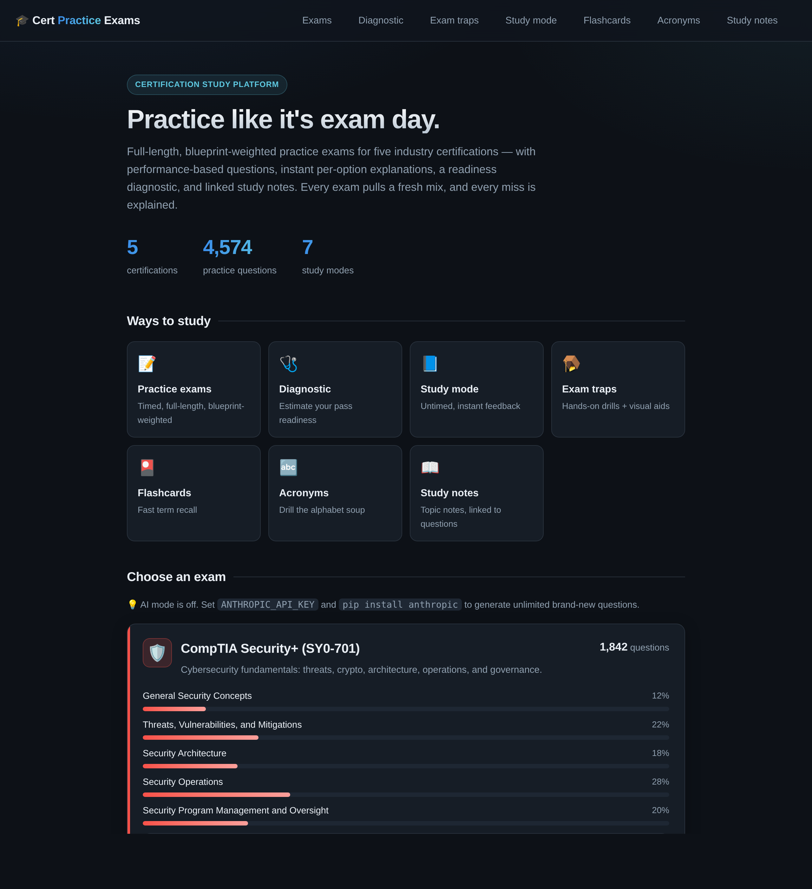
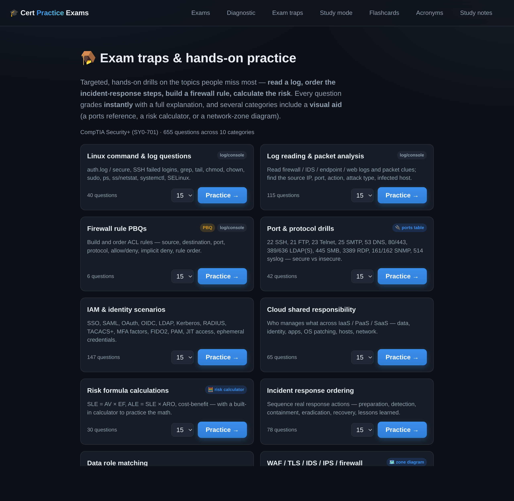
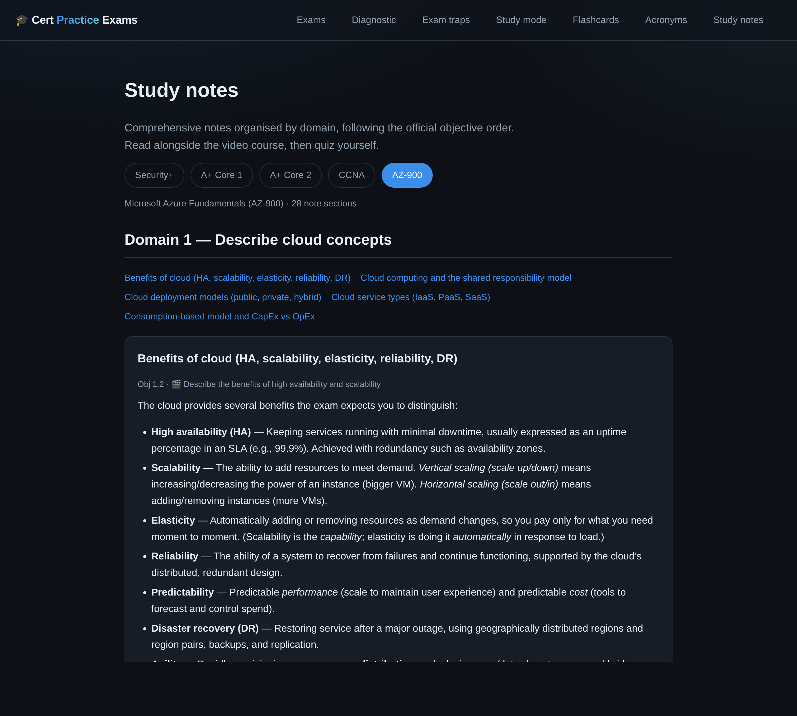

# Certification Practice Exam Platform

A full-featured web application for studying five IT certifications — **CompTIA Security+, A+ Core 1, A+ Core 2, Cisco CCNA, and Microsoft Azure Fundamentals (AZ-900)** — backed by a hand-authored bank of **4,500+ questions** with per-option explanations, performance-based questions, a diagnostic engine, and study notes.

Built with Python and Flask. Runs locally, no account required.

<p>
  
  
  
  
  
  
</p>



---

## What it does

Pick a certification, choose your mode, and study. Every practice exam draws a **fresh mix** of questions weighted to the exam's official domain blueprint, grades you server-side, and then explains **every question you missed** — including *why each wrong option is wrong* — before building a study plan that ranks your weakest domains and topics.

Each exam is calibrated to match its real-world counterpart. The CompTIA and Cisco banks use hard, scenario-based "best answer" items; the AZ-900 bank is deliberately tuned to Microsoft's actual fundamentals-level style and phrasing rather than being artificially difficult.

## Exams included

| Certification | Domains | Questions | Format |
|---|--:|--:|---|
| **CompTIA Security+** (SY0-701) | 5 | 1,842 | 90 q · 90 min · ≈83% pass · PBQs |
| **Microsoft Azure Fundamentals** (AZ-900) | 3 | 1,016 | 40 q · 45 min · 70% pass · Yes/No & matching |
| **Cisco CCNA** (200-301) | 6 | 648 | 100 q · 120 min · ≈82% pass |
| **CompTIA A+ Core 1** (220-1201) | 5 | 558 | 90 q · 90 min · ≈75% pass · PBQs |
| **CompTIA A+ Core 2** (220-1202) | 4 | 510 | 90 q · 90 min · ≈78% pass · PBQs |

## Study modes

- **📝 Practice exam** — full-length, timed, weighted to the official domain percentages, with a countdown timer and a no-repeat guarantee across sessions.
- **🩺 Diagnostic test** — a short assessment that estimates your chance of passing, identifies strongest/weakest domains and subtopics, and reads *why* you miss questions (missing knowledge vs. misreading vs. rushing) from timing and answer patterns.
- **📘 Study mode** — untimed, one question at a time with instant feedback and full explanations, filterable by domain and topic.
- **🪤 Exam traps** — hands-on drills on the topics people miss most (log reading, firewall rules, IAM flows, risk math…), with visual aids: a ports reference, an interactive SLE/ALE/ARO calculator, and a network security-zone diagram.
- **🎴 Flashcards** and **🔤 acronym drills** — quick daily reinforcement in multiple-choice or typed modes.
- **📖 Study notes** — structured, exam-aligned notes for every topic, linked to the question bank so a missed question points you straight to the relevant note.

| Exam traps & hands-on drills | Linked study notes |
|---|---|
|  |  |

## Why the questions are good

- **Per-option rationales.** Every option — right and wrong — carries a specific explanation, so you learn the *reasoning*, not just the letter.
- **Performance-based questions.** Matching, categorization, and ordering items that mirror the interactive tasks on the real CompTIA and Microsoft exams.
- **Blueprint-accurate assembly.** Questions are sampled to match each exam's published domain weightings (e.g., Security+ 12/22/18/28/20).
- **No-repeat rotation.** The app tracks what you've already seen and serves new questions until the bank is exhausted, so retakes stay fresh.
- **Per-exam calibration.** Difficulty and item style are tuned to each exam individually — hard scenario items for the pro-level exams, faithful fundamentals-level items for AZ-900.

## Quick start

```bash
pip install -r requirements.txt
python app.py
# open http://127.0.0.1:5000
```

On Windows you can instead double-click **`Start Practice Exams.bat`**, which starts the server and opens your browser automatically.

> **Optional AI mode:** set an `ANTHROPIC_API_KEY` environment variable and install `anthropic` to generate unlimited brand-new questions on the fly. The app works fully offline without it.

## Testing

A `pytest` suite guards both the engine and the content — schema-valid questions, globally unique IDs, blueprint-accurate assembly, the no-repeat rotation guarantee, grading correctness across all question types, and 100% study-note coverage. It runs on every push via GitHub Actions (Python 3.10–3.12).

```bash
pip install pytest
pytest -q
```

## How it's built

A clean, data-driven architecture — adding a whole new certification is just a new profile plus a question package, no changes to the engine.

```
app.py                     # Flask routes: exam, study, diagnostic, traps, flashcards, notes
exam/
  catalog.py               # ExamProfile registry: domains, weights, pass marks, timers
  models.py                # question schema + validation (5 question types)
  bank.py                  # auto-discovering question loader
  generator.py             # weighted assembly + no-repeat rotation
  grading.py               # server-side grading with per-option feedback
  diagnostic.py            # pass-probability + behavioral analysis
  traps.py                 # curated hands-on practice categories
  questions/<exam>/        # the question banks (one package per exam)
  notes/<exam>/            # study notes, linked to bank topics
templates/ · static/       # server-rendered UI, vanilla JS (no framework)
```

**Design highlights**

- **Answer keys never reach the browser.** Questions are stripped of correct answers before rendering and graded server-side, so nothing can be inspected client-side.
- **Schema-validated content.** Every question is validated on load (required fields, option counts, exactly-one vs. two-or-more correct), so malformed items can't slip into an exam.
- **Separation of content and engine.** Questions, notes, flashcards, and acronyms are plain Python data modules auto-discovered at load time; the assembly/grading/diagnostic logic is fully exam-agnostic.
- **Zero heavyweight dependencies.** Flask plus the standard library; the front end is server-rendered HTML with a small amount of vanilla JavaScript.

## Tech stack

**Python · Flask · Jinja2 · vanilla JavaScript · HTML/CSS** — no front-end framework, no database (question banks are versioned Python data, session state is server-side).

---

*Built as a personal study tool while preparing for these certifications.*
